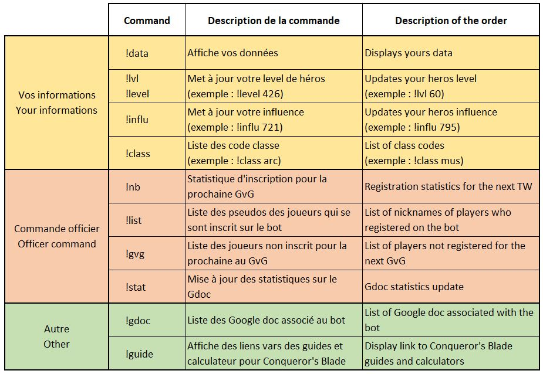
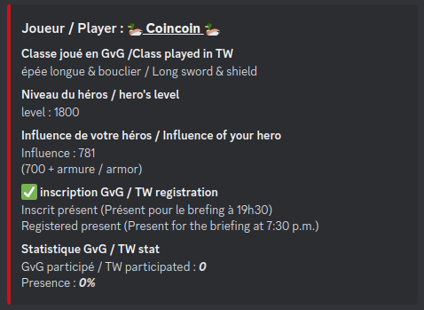

# Bot discord GvG

### Descriptif
_______
Bot discord permettant de gérer de façon automatisée les inscriptions des joueurs pour le jeu Conqueror's Blade.
Les informations d'inscription des joueurs sont envoyé automatiquement sur un Google Doc en ligne permettant au joueur en charge de la création des groupes de préparer la guerre de territoire à l'avance en optimisant les groupes en fonction des classes joué par les joueurs, mais également en fonction des unités (et d'autres paramètres) à leur disposition.

Voici la liste des commandes auquel le bot répondra <br>


Voici un exemple des informations visible par chaque utilisateur <br>



### Usage
_______
```go
npm start
```

### Authors
_______
+ Fabien OLIVIER
